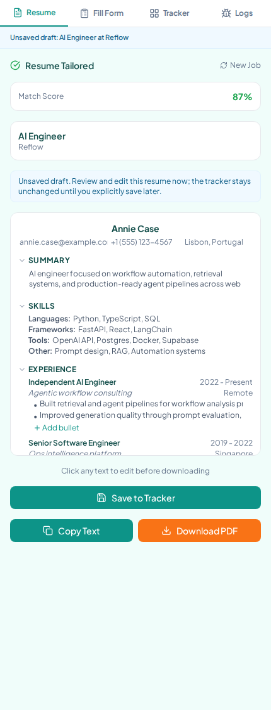
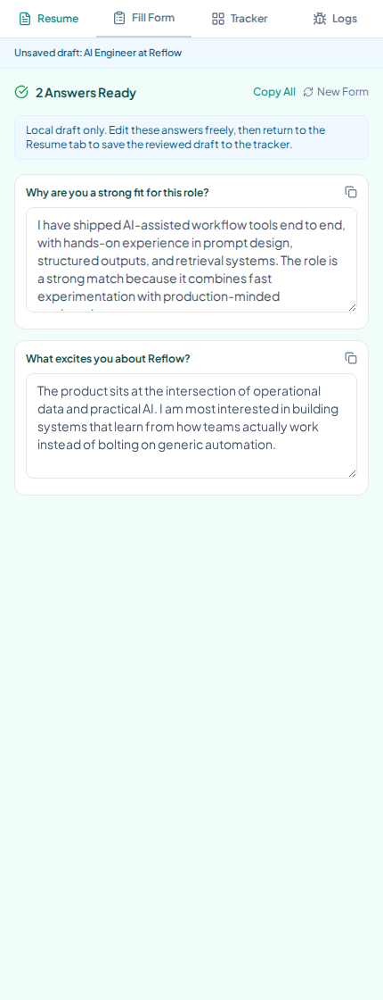
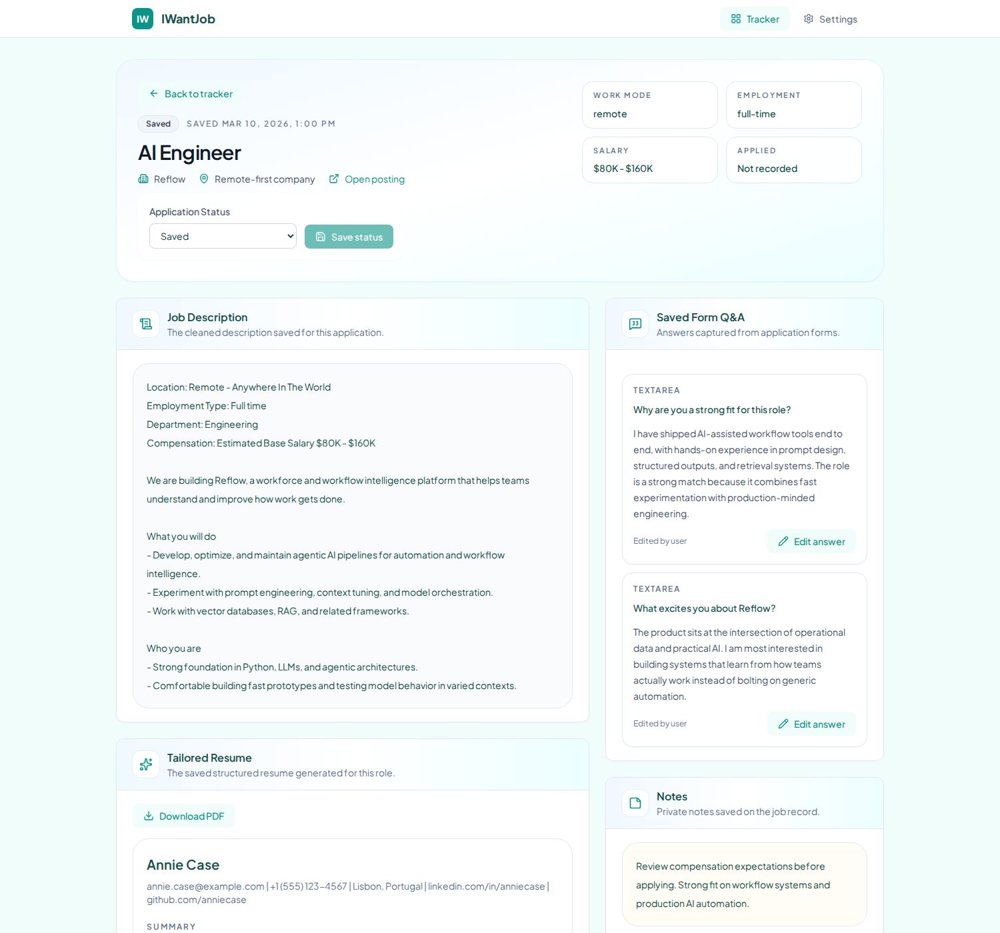

# IWantJob

IWantJob is an open-source Chrome extension plus FastAPI backend for AI-assisted job applications.

It helps you extract job descriptions, tailor a resume to a specific role, generate draft answers for application forms, and save approved applications into a tracker and detail workspace.

## What It Does

- Extracts job descriptions from the current tab
- Tailors your resume against a specific role
- Generates draft Q&A for application forms
- Lets you review and edit AI output before saving
- Saves approved applications into a tracker backed by Supabase
- Opens saved applications in a detail workspace with notes, resume, and Q&A

## Current Workflow

The current product flow is draft-first:

1. Open a job page and extract the job description in the sidepanel
2. Tailor your resume for that job
3. Open the Fill Form tab and generate draft answers
4. Edit the resume and answers locally
5. Click `Save to Tracker` only when the draft is ready
6. Manage the saved application later from the tracker and detail view

This is important: AI output is not supposed to auto-save immediately. The tracker is intended to store reviewed application records, not raw first-pass drafts.

## Screenshots

These screenshots were captured from the current UI with Playwright.

<table>
  <tr>
    <td valign="top">
      
      <p><strong>Resume draft in the sidepanel</strong><br>Review the extracted role, edit the tailored resume inline, then explicitly save only when the draft is ready.</p>
    </td>
    <td valign="top">
      
      <p><strong>Editable Fill Form answers</strong><br>Generated answers stay local and editable so the user can clean them up before anything is written to Supabase.</p>
    </td>
  </tr>
</table>

<p>
  
</p>
<p><strong>Tracker detail workspace</strong><br>Once saved, each application opens in a richer workspace for status updates, notes, saved Q&amp;A, and resume review.</p>

## Core Product Areas

### Sidepanel

- `Resume`
  Extracts the JD, generates a tailored resume, supports inline editing, and saves approved drafts

- `Fill Form`
  Extracts form fields, generates draft answers, and keeps them editable until you save from Resume

- `Tracker`
  Opens the saved application tracker workflow

- `Logs`
  Helps inspect extension-side debug output

### Options Page

- Job tracker with search, filtering, sorting, editing, and delete
- Full job detail workspace for JD, tailored resume, Q&A, notes, and status
- Settings for backend URL, AI configuration, Supabase configuration, and base resume

### Backend

- FastAPI API for tailoring, form generation, PDF generation, and CRUD
- LiteLLM-based AI provider abstraction
- Supabase-backed persistence for jobs, resumes, and Q&A

## Architecture

The project has 3 main pieces:

- `extension/`
  A Plasmo-based Chrome extension with content scripts, sidepanel UI, and options page

- `backend/`
  A FastAPI service that handles AI calls, PDF generation, and Supabase-backed data operations

- `supabase/`
  SQL migrations for the user-owned database schema

IWantJob uses a Bring-Your-Own stack:

- your AI provider key
- your Supabase project
- your local backend process

## Repository Layout

```text
IWantJob/
├── extension/   # Chrome extension (Plasmo + React + TypeScript)
├── backend/     # FastAPI backend
├── supabase/    # DB migrations
├── docs/        # PRD, SRS, roadmap, release checklist, planning docs
└── design-system/
```

## Current Status

The implementation has already reached:

- draft-first sidepanel workflow
- explicit save-to-tracker flow
- tracker and job detail workspace
- structured JD extraction and metadata extraction
- tailored resume PDF generation
- recovery handling for saved vs unsaved drafts

The repository now has a public-facing setup guide and a screenshot-backed workflow overview. The remaining documentation work is mostly publish-readiness polish around sharing and safe push boundaries.

## Setup

### 1. Clone and install dependencies

At the repo root:

```bash
npm install
```

For the extension:

```bash
cd extension
npm install
```

For the backend:

```bash
cd backend
python3 -m venv .venv
.venv/bin/pip install -r requirements.txt
```

### 2. Start the backend

From `backend/`:

```bash
.venv/bin/python3 -m uvicorn app.main:app --host 0.0.0.0 --port 8000 --reload
```

Alternative:

```bash
docker compose up backend
```

The backend defaults to `http://localhost:8000`.

### 3. Prepare Supabase

You need your own Supabase project.

- Create a project in Supabase
- Apply the SQL migrations in `supabase/migrations/`
- Collect:
  - project URL
  - anon/service key used by this local workflow

If you use the Supabase CLI from the repo root:

```bash
supabase db push
```

### 4. Build and load the extension

From `extension/`:

```bash
npm run build
```

Then in Chrome:

1. Open `chrome://extensions`
2. Enable `Developer mode`
3. Click `Load unpacked`
4. Select `extension/build/chrome-mv3-prod`

### 5. Configure the extension

Open the extension options page and provide:

- Backend URL
  - usually `http://localhost:8000`
- Supabase URL
- Supabase key
- Base resume
- AI provider/model/key

The product currently expects a Bring-Your-Own setup:

- your backend process
- your Supabase project
- your AI credentials

## How To Use

### Initial bootstrap

1. Start the backend
2. Load the unpacked extension
3. Open the options page
4. Configure backend URL, Supabase, AI model, and base resume

### Normal application workflow

1. Open a job description page
2. Open the extension sidepanel
3. In `Resume`, click `Get Job Description`
4. Review the extracted JD and click `Tailor Resume`
5. Edit the tailored resume locally if needed
6. Switch to `Fill Form`
7. Click `Get Form Fields`
8. Generate draft answers and edit them locally
9. Go back to `Resume`
10. Click `Save to Tracker`

Important:

- tailoring does not save automatically
- form generation does not save automatically
- the tracker is meant to contain reviewed application records only

### After saving

Once a draft is saved:

- the tracker row appears in the options page
- the detail workspace can show:
  - job description
  - tailored resume
  - saved Q&A
  - notes
  - status

## Troubleshooting

### The sidepanel cannot reach the backend

Check:

- the backend process is running
- the backend URL in extension settings is correct
- the backend is reachable at `http://localhost:8000/health`

### Tailor Resume or Fill Form does nothing useful

Check:

- an AI provider/model/key is configured
- a base resume is saved in settings
- the page actually contains a readable JD or form

### The tracker still shows nothing

Check:

- you clicked `Save to Tracker`
- Supabase URL/key are configured
- the backend can talk to Supabase

### Chrome is still showing old UI code

Rebuild and reload the extension:

```bash
cd extension
npm run build
```

Then reload the unpacked extension in `chrome://extensions`.

### The product feels stuck between draft and saved state

This is usually a workflow issue, not a model issue:

- `Resume` and `Fill Form` create local drafts first
- only `Save to Tracker` writes the reviewed application to Supabase
- after new edits, a saved application can re-enter unsaved draft state until you save again

## Notes

- This is not a hosted SaaS product. You are expected to run the backend and provide your own credentials.
- The current build flow uses `npm run build` for the extension.
- Manual release/testing guidance currently lives in [docs/release-checklist.md](docs/release-checklist.md).
