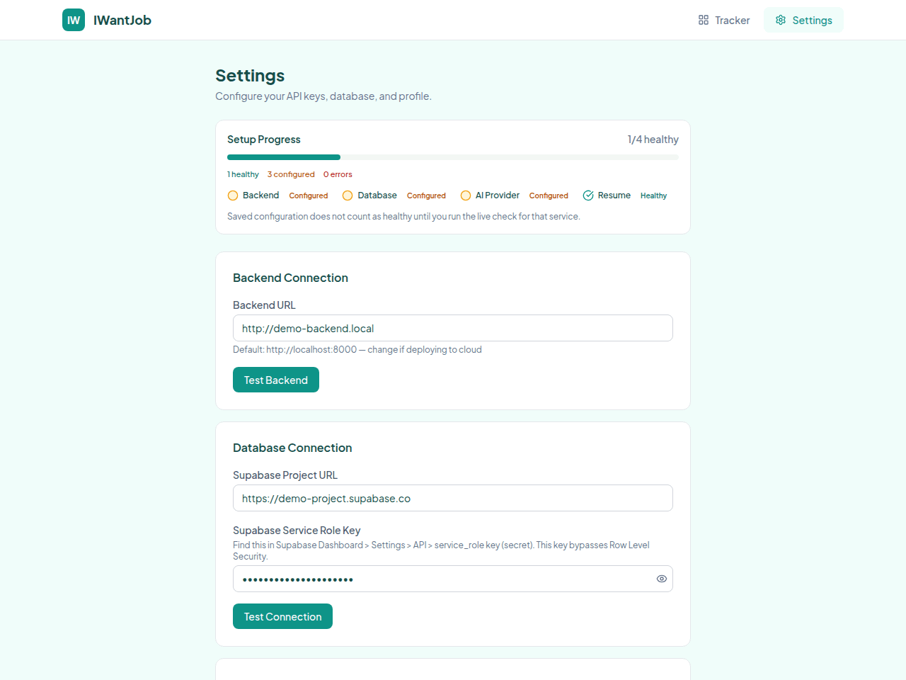
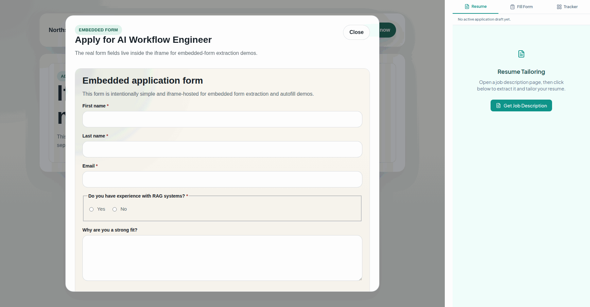

<div align="center">
  
  <h1>IWantJob</h1>
  <p><strong>AI-powered job applications — from job post to submitted form — in one open-source Chrome extension.</strong></p>
  <p>
  
  
  
  
</p>
</div>

<br>

<div align="center">
  
  <p><em>Extract a job description, tailor your resume, generate form answers — then review everything before saving.</em></p>
</div>

<br>

IWantJob gives you a complete AI-assisted application workflow inside your browser. Extract a job description from any tab, tailor your resume to the role, generate draft answers for the application form, autofill supported fields, and save the reviewed result into a personal tracker — all without leaving the page.

Everything is **draft-first**. AI output stays local and editable until you explicitly save it. The tracker records the application *you* approved, not the model's first pass.

**Bring your own stack** — your AI key, your Supabase database, your local backend. No SaaS, no subscriptions, fully open source.

---

## Features

<table>
  <tr>
    <td width="50%" valign="top">
      <h3>Resume Tailoring</h3>
      
      <p>Extract the job description from the active tab and generate a resume tailored to that specific role. Edit inline before moving to the application form.</p>
    </td>
    <td width="50%" valign="top">
      <h3>Form Fill + Autofill</h3>
      
      <p>Scan the application form, generate draft answers grounded in your resume and the JD, then autofill supported fields — text, select, radio, checkbox, file upload, custom comboboxes, and iframe-hosted forms.</p>
    </td>
  </tr>
</table>

<table>
  <tr>
    <td width="50%" valign="top">
      <h3>Application Tracker</h3>
      
      <p>Every saved application gets a full detail workspace — job description, tailored resume, all Q&A pairs, notes, and status tracking. Search, filter, sort, and manage applications from a single view.</p>
    </td>
    <td width="50%" valign="top">
      <h3>Your Stack, Your Data</h3>
      <ul>
        <li><strong>AI provider:</strong> OpenAI, Anthropic, Gemini, DeepSeek, or Ollama</li>
        <li><strong>Database:</strong> Your own Supabase project</li>
        <li><strong>Backend:</strong> Self-hosted FastAPI (Docker or local Python)</li>
        <li><strong>Persona:</strong> Optional context to improve answer framing beyond your resume</li>
      </ul>
      <p>No telemetry. No analytics. No API keys stored on any server. Keys are passed per-request in headers and never persisted by the backend.</p>
    </td>
  </tr>
</table>

---

## How It Works

```
  Extract JD  ──>  Tailor Resume  ──>  Fill Form  ──>  Review & Edit  ──>  Save to Tracker
```

| Step | What happens |
|------|-------------|
| **1. Extract** | Open a job posting. The extension pulls the job description from the page using Mozilla Readability. |
| **2. Tailor** | Generate a resume tailored to that role. Review the structured preview, edit sections inline, download as PDF. |
| **3. Fill** | Switch to the application form. Extract fields, generate draft answers, review each one. |
| **4. Autofill** | Push reviewed answers into supported form controls. Get a field-by-field fill report showing what worked and what needs manual entry. |
| **5. Save** | Save the approved application — JD, tailored resume, and all Q&A pairs — into your Supabase-backed tracker. |

<details>
<summary><strong>See it in action</strong></summary>

<br>

**Settings and initial setup**



<br>

**Form fill and autofill**


<br>

**Save and tracker workspace**


<br>

**Advanced form support (iframes, comboboxes)**



</details>

---

## Run Locally

### Prerequisites

- Node.js + npm
- Python 3.11+
- A [Supabase](https://supabase.com) project
- An AI provider API key (OpenAI, Anthropic, Gemini, DeepSeek, or local Ollama)
- Chrome or Chromium

### 1. Clone and install

```bash
git clone https://github.com/anthropics/IWantJob.git
cd IWantJob

# Extension dependencies
cd extension && npm install && cd ..

# Backend dependencies
cd backend
python3 -m venv .venv
.venv/bin/pip install -r requirements.txt
cd ..
```

### 2. Set up Supabase

Apply the SQL migrations in `supabase/migrations/` to your Supabase project:

```bash
# Using Supabase CLI
supabase db push

# Or paste the migration SQL files into the Supabase Dashboard SQL editor
```

Collect your **project URL** and **service_role key** — you'll need them in the extension settings for the current pre-auth runtime mode.

### 3. Start the backend

<table>
<tr>
<td width="50%">

**Docker** (recommended)

```bash
docker compose up --build -d backend
```

</td>
<td width="50%">

**Local Python**

```bash
cd backend
.venv/bin/python3 -m uvicorn \
  app.main:app \
  --host 0.0.0.0 --port 8000 --reload
```

</td>
</tr>
</table>

Both expose the backend at `http://localhost:8000`. Verify with:

```bash
curl http://localhost:8000/health
```

### 4. Build and load the extension

```bash
cd extension && npm run build
```

In Chrome:
1. Open `chrome://extensions`
2. Enable **Developer mode**
3. Click **Load unpacked**
4. Select `extension/build/chrome-mv3-prod`

### 5. Configure

Open the extension options page and set:

- **Backend URL** — `http://localhost:8000`
- **Supabase URL** + **service role key**
- **AI provider**, **model**, and **API key**
- **Base resume** (paste your resume text)
- **Persona** (optional — adds context beyond your resume for better answers)

---

## Architecture

```
Chrome Extension  ──HTTPS──>  FastAPI Backend  ──>  Supabase (user-owned)
(Plasmo + React)                    │
                                    v
                              LiteLLM (AI abstraction)
                              OpenAI / Anthropic / Gemini / DeepSeek / Ollama
```

| Layer | Stack |
|-------|-------|
| Extension | Plasmo + React 18 + TypeScript + Tailwind CSS |
| Backend | FastAPI + LiteLLM + ReportLab (PDF) |
| Database | Supabase (PostgreSQL) |
| Deployment | Docker Compose or local Python |

```
IWantJob/
├── extension/   # Chrome extension (Plasmo + React + TypeScript)
├── backend/     # FastAPI backend (Python)
├── supabase/    # Database migrations
└── assets/      # Screenshots and demo GIFs
```

---

## Development

### Playwright smoke tests

```bash
cd extension
npx playwright install chromium
PLAYWRIGHT_SKIP_EXTENSION_BUILD=1 npx playwright test tests/smoke.spec.ts
```

For a visible browser window, add `--headed`. On WSL, this requires WSLg or an X server. If browser dependencies are missing:

```bash
npx playwright install --with-deps chromium
```

---

## License

[AGPL-3.0](./LICENSE) — you can self-host, modify, and redistribute. Network use of a modified version requires offering the corresponding source. The license does not grant rights to the IWantJob name or branding ([TRADEMARKS.md](./TRADEMARKS.md)).
